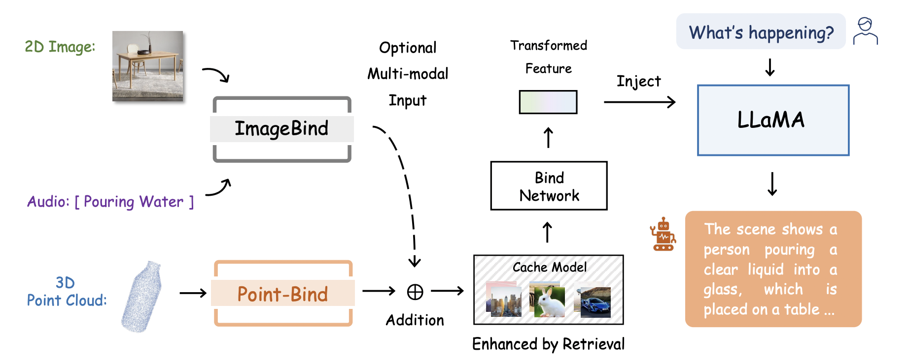

# Point-Bind & Point-LLM: Aligning 3D with Multi-modality

Official implementation of ['Point-Bind & Point-LLM: Aligning Point Cloud with Multi-modality for 3D Understanding, Generation, and Instruction Following'](https://github.com/ZiyuGuo99/Point-Bind_Point-LLM/blob/main/Point-Bind%20%26%20Point-LLM.pdf).

* 🔥 **Point-Bind** is a 3D multi-modality model with a joint embedding space among 3D point cloud, image, language, audio, and video
* 🔥 **Point-LLM** is ***the first*** 3D large language model, which ***requires no 3D instruction data*** 🌟 and ***reasons 3D multi-modality input*** 🌟
* Try our 💥 [Online Demo](http://imagebind-llm.opengvlab.com/) here, which is integrated into [ImageBind-LLM](https://github.com/OpenGVLab/LLaMA-Adapter)

## News
* **[2023-09-04]** The paper of this project is available on arXiv 🚀.
* **[2023-05-20]** The inference code of Point-Bind and Point-LLM is released 📌.

## Point-Bind

With a joint embedding space of 3D and multi-modality, our Point-Bind empowers four promising applications:

<p align="center">                                                                                                                                           <br>
</p>

## Point-LLM

Using Point-Bind, we introduce Point-LLM, ***the first 3D LLM*** that responds to instructions with 3D point cloud conditions, supporting both English and Chinese. Our Point-LLM exhibits two main characters:

- $\color{darkorange}{Data\ and\ Parameter\ Efficiency\ .}$ We only utilize public vision-language data for tuning without any 3D instruction data, and adopt parameter-efficient finetuning techniques, saving extensive resources.

- $\color{darkorange}{3D\ and\ MultiModal\ Reasoning.}$ Via the joint embedding space, Point-LLM can generate descriptive responses by reasoning a combination of 3D and multimodal input, e.g., a point cloud with an image/audio.

<p align="center">                                                                                                                                           <br>
</p>

The overall pipeline of Point-LLM is as follows. We efficiently fine-tune [LLaMA 7B](https://github.com/facebookresearch/llama) for 3D instruction-following capacity referring to [LLaMA-Adapter](https://arxiv.org/pdf/2303.16199.pdf%20%C3%A2%E2%82%AC%C5%BE%3Emultimodalno%C3%85%E2%80%BA%C3%84%E2%80%A1%3C/a%3E,%C3%82%C2%A0%3Ca%20href=) and [ImageBind-LLM](https://github.com/OpenGVLab/LLaMA-Adapter):

<p align="center">                                                                                                                                           <br>
</p>

## Getting Started
Please refer to [Install.md](https://github.com/ZiyuGuo99/Point-Bind_Point-LLM/blob/main/Install.md) for preparing environments and pre-trained checkpoints.

### 3D with Multi-modalities

We provide simple inference scripts to verify the embedding alignment for 3D and other modalities in Point-Bind.

#### Compare 3D with Text
Run `python demo_text_3d.py` with input:
```
text_list = ['An airplane', 'A car', 'A toilet']
point_paths = ["examples/airplane.pt", "examples/car.pt", "examples/toilet.pt"]
```
Output the similarity matrix:
```
Text x Point Cloud
tensor([[1.0000e+00, 6.5731e-09, 6.5958e-10],
        [1.7373e-06, 9.9998e-01, 1.7816e-05],
        [2.1133e-10, 3.4070e-08, 1.0000e+00]])
```

#### Compare 3D with Audio
Run `python demo_audio_3d.py` with input:
Input
```
audio_paths = ["examples/airplane_audio.wav", "examples/car_audio.wav", "examples/toilet_audio.wav"]
point_paths = ["examples/airplane.pt", "examples/car.pt", "examples/toilet.pt"]
```
Output the similarity matrix:
```
Audio x Point Cloud: 
tensor([[0.9907, 0.0041, 0.0051],
        [0.0269, 0.9477, 0.0254],
        [0.0057, 0.0170, 0.9773]])
```

### 3D Zero-shot Tasks
For 3D zero-shot classification, please follow [DATASET.md](https://github.com/lulutang0608/Point-BERT/blob/master/DATASET.md) to download ModelNet40, and put it under `data/modelnet40_normal_resampled/`. Then run `bash scripts/pointbind_i2pmae.sh` or `bash scripts/pointbind_pointbert.sh` for Point-Bind with I2P-MAE or Point-BERT encoder.

Zero-shot classification accuracy comparison:
|  Model | Encoder | ModeNet40 (%)|
| :-----: | :-----: |:-----:|
|  [PointCLIP](https://github.com/ZrrSkywalker/PointCLIP) | 2D CLIP |20.2|
|  [ULIP](https://github.com/salesforce/ULIP) | Point-BERT |60.4|
|  [PointCLIP V2](https://github.com/yangyangyang127/PointCLIP_V2) | 2D CLIP |64.2|
|  [ULIP 2](https://github.com/salesforce/ULIP) | Point-BERT |66.4|
|  Point-Bind | [Point-BERT](https://github.com/lulutang0608/Point-BERT) |76.3|
|  Point-Bind | [I2P-MAE](https://github.com/ZrrSkywalker/I2P-MAE) |**78.0**|


## Contributors
Ziyu Guo, Renrui Zhang, Xiangyang Zhu, Yiwen Tang, Peng Gao

## Related Work
Other excellent works for incorporating 3D point clouds and LLMs: 
* [PointLLM](https://github.com/OpenRobotLab/PointLLM): Collect a novel dataset of point-text instruction data to tune LLMs in 3D
* [3D-LLM](https://github.com/UMass-Foundation-Model/3D-LLM): Render 3D scenes into multi-view images to enable various 3D-related tasks

## Contact
If you have any questions about this project, please feel free to contact zhangrenrui@pjlab.org.cn and zyguo@cse.cuhk.edu.hk.
