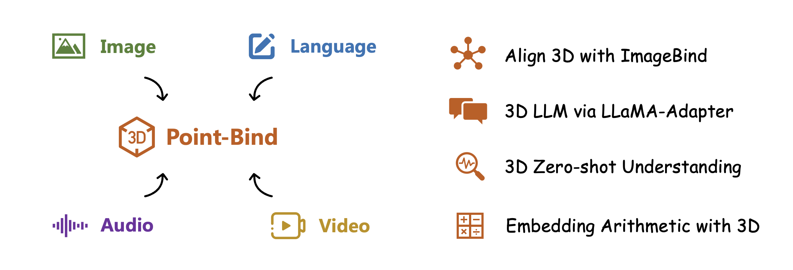
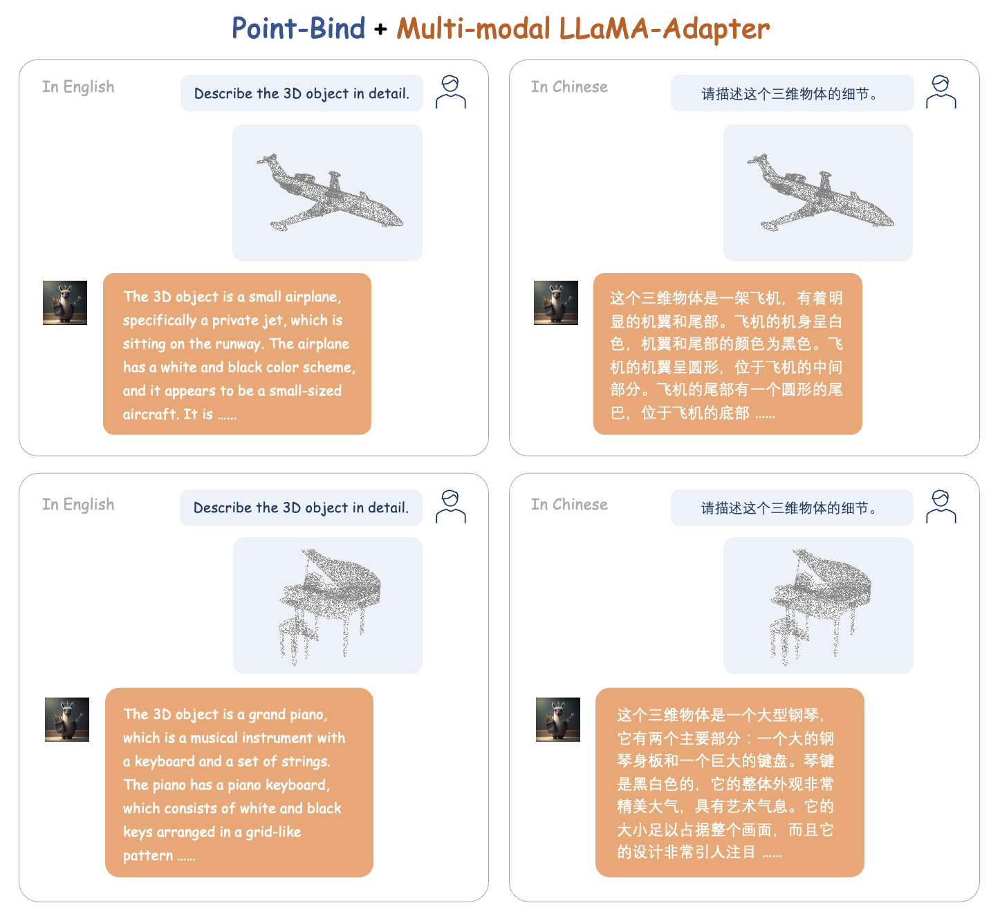

# Point-Bind: Align 3D Point Clouds with Multi-modalities

This project presents **Point-Bind** 🔥, a 3D multi-modality model that aligns **3D point clouds** with image, language, audio, and videos guided by [ImageBind](https://github.com/facebookresearch/ImageBind). The 3D encoder of Point-Bind is based on [I2P-MAE](https://github.com/ZrrSkywalker/I2P-MAE).

## Overview

Our Point-Bind exhibits four main characters:

<p align="center">                                                                                                                                           <br>
</p>

- $\color{darkorange}{Align\ 3D\ with\ ImageBind\ .}$ With a joint embedding space, 3D objects can be aligned with their corresponding 2D images, textual descriptions, and audio.
- $\color{darkorange}{3D\ LLM\ via\ LLaMA-Adapter\ .}$ In [Multi-modal LLaMA-Adapter](https://github.com/ZrrSkywalker/LLaMA-Adapter/tree/main/imagebind_LLM) (ImageBind-LLM), we introduce an LLM following 3D instructions in Engish/中文 ***for the first time***.
- $\color{darkorange}{3D\ Zero-shot\ Understanding\ .}$ Point-Bind achieves ***state-of-the-art*** performance for 3D zero-shot classification, compared with PointCLIP and ULIP.
- $\color{darkorange}{Embedding\ Arithmetic\ with\ 3D\ .}$ We observe that 3D features from Point-Bind can be added with other modalities to compose their semantics.

## News
* The 3D instruction-following LLM via Multi-modal LLaMA-Adapter has been released, please referring to [ImageBind-LLM](https://github.com/ZrrSkywalker/LLaMA-Adapter/tree/main/imagebind_LLM) 📌.
* The 3D zero-shot classification code of Point-Bind has been released 📌.


## Getting Started
Please refer to [Install.md](https://github.com/ZrrSkywalker/Point-Bind/blob/main/Install.md) for preparing environments and pre-trained checkpoints.

### 3D with Multi-modalities

We provide simple inference scripts to verify the embedding alignment for 3D and other modalities in Point-Bind.

#### Compare 3D with Text
Run `python demo_text_3d.py` with input:
```
text_list = ['An airplane', 'A car', 'A toilet']
point_paths = ["examples/airplane.pt", "examples/car.pt", "examples/toilet.pt"]
```
Output the similarity matrix:
```
Text x Point Cloud
tensor([[1.0000e+00, 6.5731e-09, 6.5958e-10],
        [1.7373e-06, 9.9998e-01, 1.7816e-05],
        [2.1133e-10, 3.4070e-08, 1.0000e+00]])
```

#### Compare 3D with Audio
Run `python demo_audio_3d.py` with input:
Input
```
audio_paths = ["examples/airplane_audio.wav", "examples/car_audio.wav", "examples/toilet_audio.wav"]
point_paths = ["examples/airplane.pt", "examples/car.pt", "examples/toilet.pt"]
```
Output the similarity matrix:
```
Audio x Point Cloud: 
tensor([[0.9907, 0.0041, 0.0051],
        [0.0269, 0.9477, 0.0254],
        [0.0057, 0.0170, 0.9773]])
```

### 3D LLM via LLaMA-Adapter
Please refer to [ImageBind-LLM](https://github.com/ZrrSkywalker/LLaMA-Adapter/tree/main/imagebind_LLM) for Multi-modal LLaMA-Adapter, which performs strong instruction-following capabilities for image, audio, and 3D point cloud conditions. The examples are shown as follows:

<p align="center">                                                                                                                                           <br>
</p>

### 3D Zero-shot Tasks
For 3D zero-shot classification, please follow [DATASET.md](https://github.com/lulutang0608/Point-BERT/blob/master/DATASET.md) to download ModelNet40, and put it under `data/modelnet40_normal_resampled/`. Then run `bash scripts/pointbind_i2pmae.sh` or `bash scripts/pointbind_pointbert.sh` for Point-Bind with I2P-MAE or Point-BERT encoder.

Zero-shot classification accuracy comparison:
|  Model | Encoder | ModeNet40 (%)|
| :-----: | :-----: |:-----:|
|  [PointCLIP](https://github.com/ZrrSkywalker/PointCLIP) | 2D CLIP |20.2|
|  [ULIP](https://github.com/salesforce/ULIP) | Point-BERT |60.4|
|  [PointCLIP V2](https://github.com/yangyangyang127/PointCLIP_V2) | 2D CLIP |64.2|
|  [ULIP 2](https://github.com/salesforce/ULIP) | Point-BERT |66.4|
|  Point-Bind | [Point-BERT](https://github.com/lulutang0608/Point-BERT) |76.3|
|  Point-Bind | [I2P-MAE](https://github.com/ZrrSkywalker/I2P-MAE) |**78.0**|


## Contributors
Ziyu Guo, Renrui Zhang, Xiangyang Zhu, Peng Gao

## Contact
If you have any question about this project, please feel free to contact zhangrenrui@pjlab.org.cn and zyguo@cse.cuhk.edu.hk.
