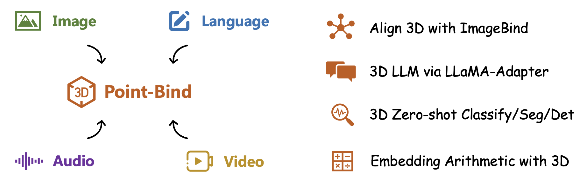

# Point-Bind: Align 3D Point Clouds with Multi-modalities

This project presents **Point-Bind**, a 3D multi-modality model that aligns **3D point clouds** with image, language, audio, and videos via [ImageBind](https://github.com/facebookresearch/ImageBind).

## Overview
Our Point-Bind 

                                                                                                                                            

